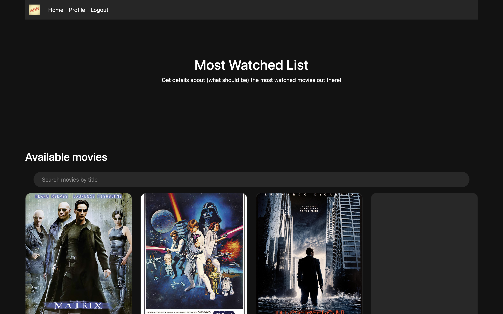
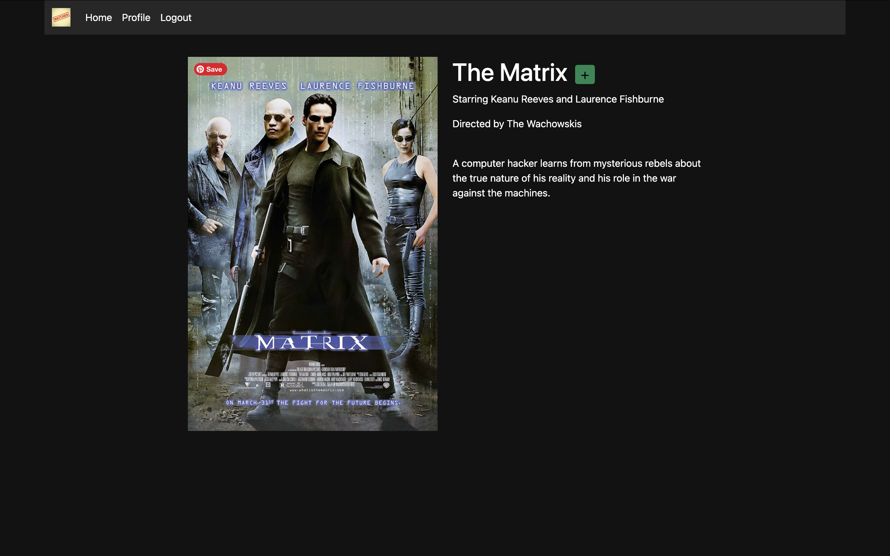
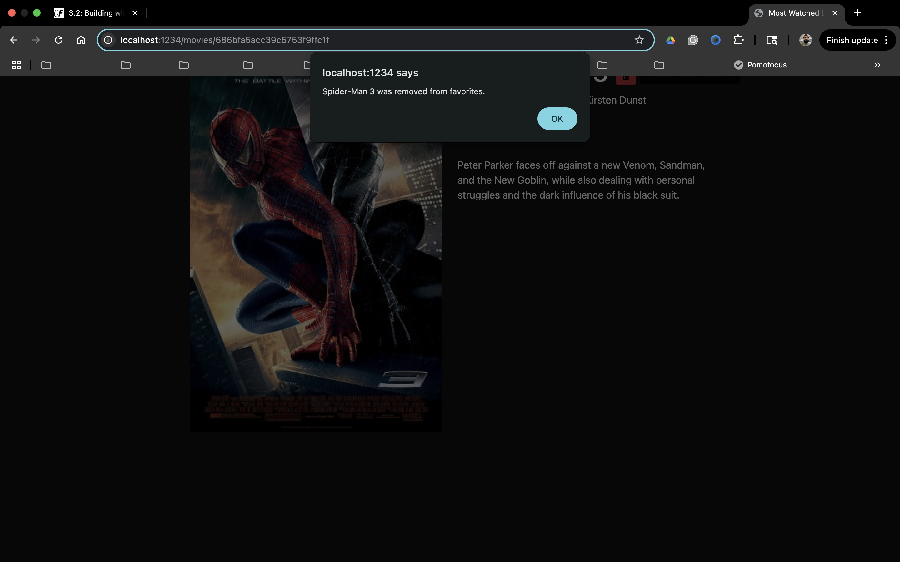
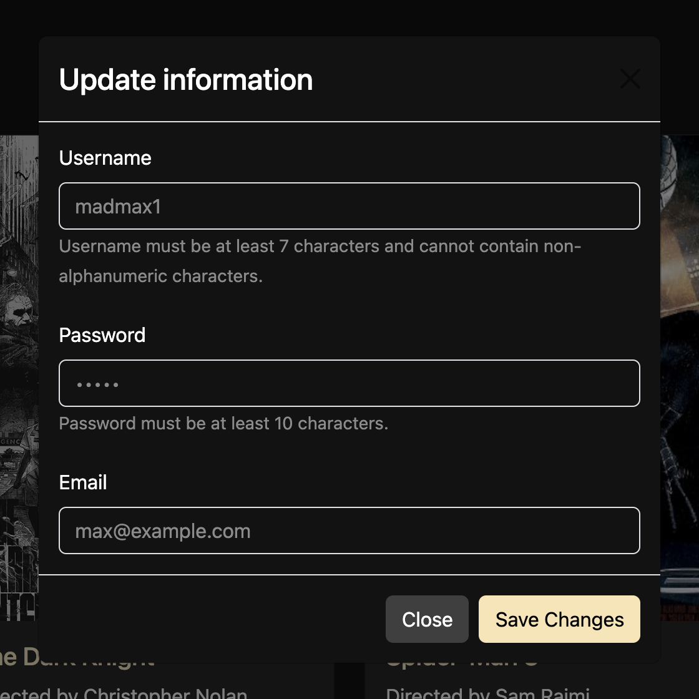

# Most Watched List

The React-built client-side for an app called Most Watched List based on its existing server-side code (REST API and database).

Hosted site: https://mostwatchedlist.netlify.app/

## Features

-   **User:** Register and login as a user.
-   **Movie list:** Provides a list of movie cards with information about each movie, such as featured actors, directors, etc.
-   **Search via title:** Filter the list by inputting a title.
-   **Favorites:** Add or remove movies from a favorites list.

## Tools

-   **Backend:** Node.js, Express.js, MongoDB (via [Movie API](https://github.com/micujones/movie_api))
-   **Frontend:** React, React Bootstrap, React Router
-   **Bundler:** Parcel
-   **API hosting:** Heroku (via [Movie API](https://github.com/micujones/movie_api))
-   **Hosting:** Netlify

## Installation

Clone repo:

```sh
gh repo clone micujones/mostwatchedlist-client
```

Install NPM packages

```sh
npm install
```

## Usage

### Start application

```sh
parcel src/index.html
```

### Main View

The main view includes movie cards for all of the movies in the database. The search bar allows for users to filter the rendered list based on movie title:<br>



### Movie View

The movie view renders details about the selected movie and can be added/removed from this screen:<br>
 

### Profile View

The profile view renders the user's username, email, and favorite movies:<br>
<br><br>
User's can update or delete their account from the profile view:


###
